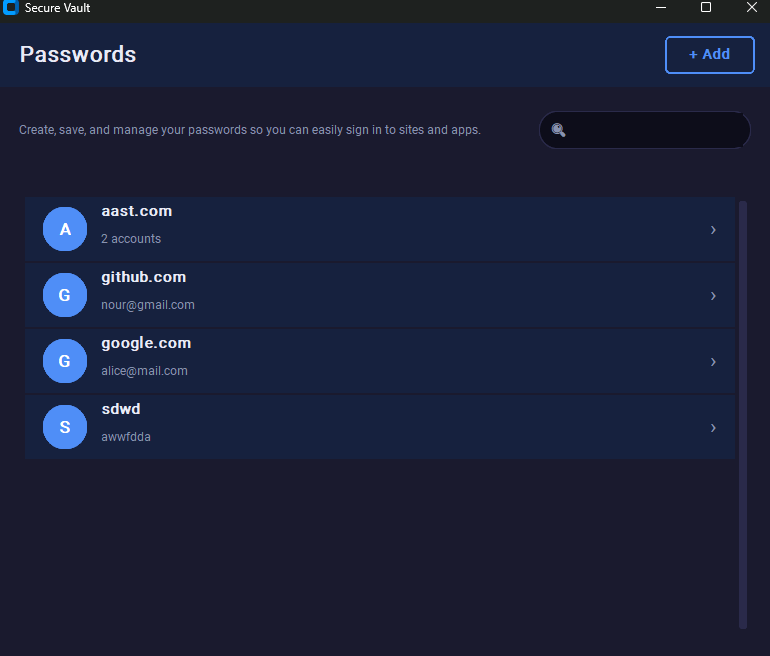
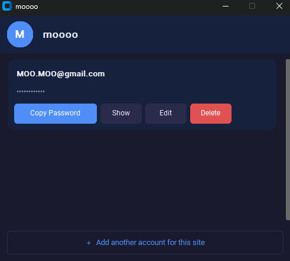

# Secure Vault

**Developed by:**
* Aly Eldeen Eldowaik 
* Ibrahem Mahmoud 
* Youssef Mohamed
* Nour Eldeen Mohamed 

## Overview
Secure Vault is a robust, local password manager designed with Zero-Knowledge Architecture. It utilizes AES-256-GCM encryption to ensure that your credentials remain completely secure. The project features both a Command-Line Interface (CLI) and a modern Graphical User Interface (GUI), alongside an integration with HaveIBeenPwned (HIBP) to check for compromised passwords securely.

## Features
- **Strong Encryption:** AES-256-GCM with PBKDF2-HMAC-SHA256 key derivation.
- **Dual Interface:** Accessible via a flexible CLI or a sleek GUI built with CustomTkinter.
- **Password Leak Check:** HIBP API integration checks for breaches using the k-anonymity model (only the first 5 characters of a SHA-1 hash leave your machine).
- **Clipboard Security:** Passwords copied to the clipboard are automatically cleared after 30 seconds to prevent unauthorized access.

## Screenshots

### GUI Dashboard


### CLI Interface


## Installation & Setup

1. **Clone the repository:**
   ```bash
   git clone [https://github.com/aly598/Secure-Vault-Password-Manager.git](https://github.com/aly598/Secure-Vault-Password-Manager.git)